# 10-K Agentic RAG 架构导图

> 用法：这些是可复制到支持 Mermaid 的 Markdown / slides 工具里的导图。每一块都对应 presentation 里的一个重点模块。

## 1. 全局系统导图

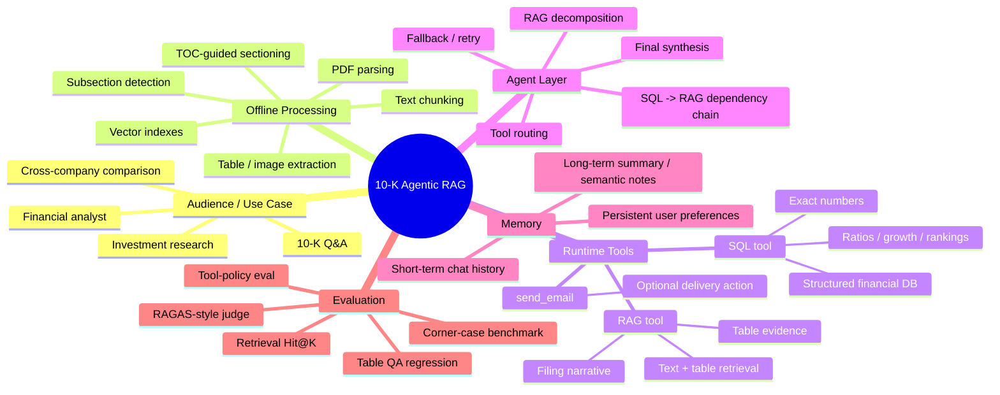

## 2. Offline Parsing 到 Chunking 导图

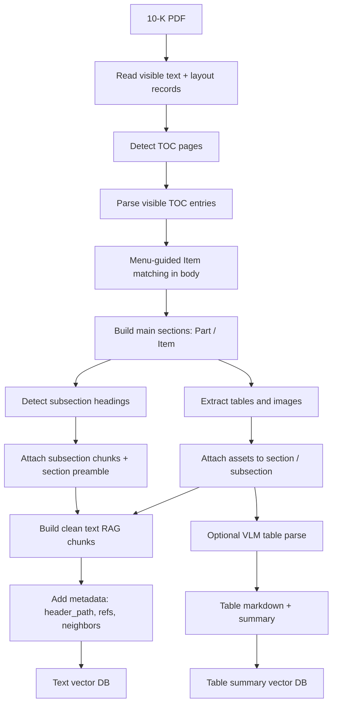

## 3. Section / Subsection Detection 导图

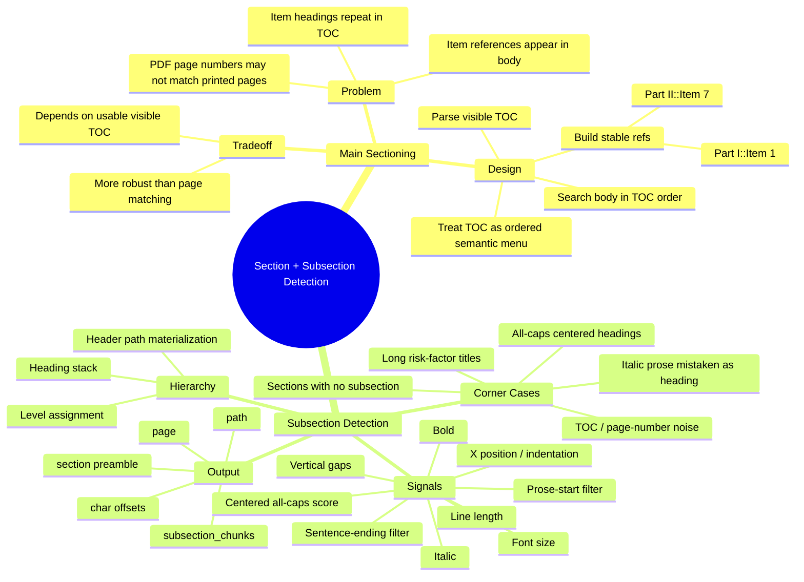

## 4. Text Chunking 导图

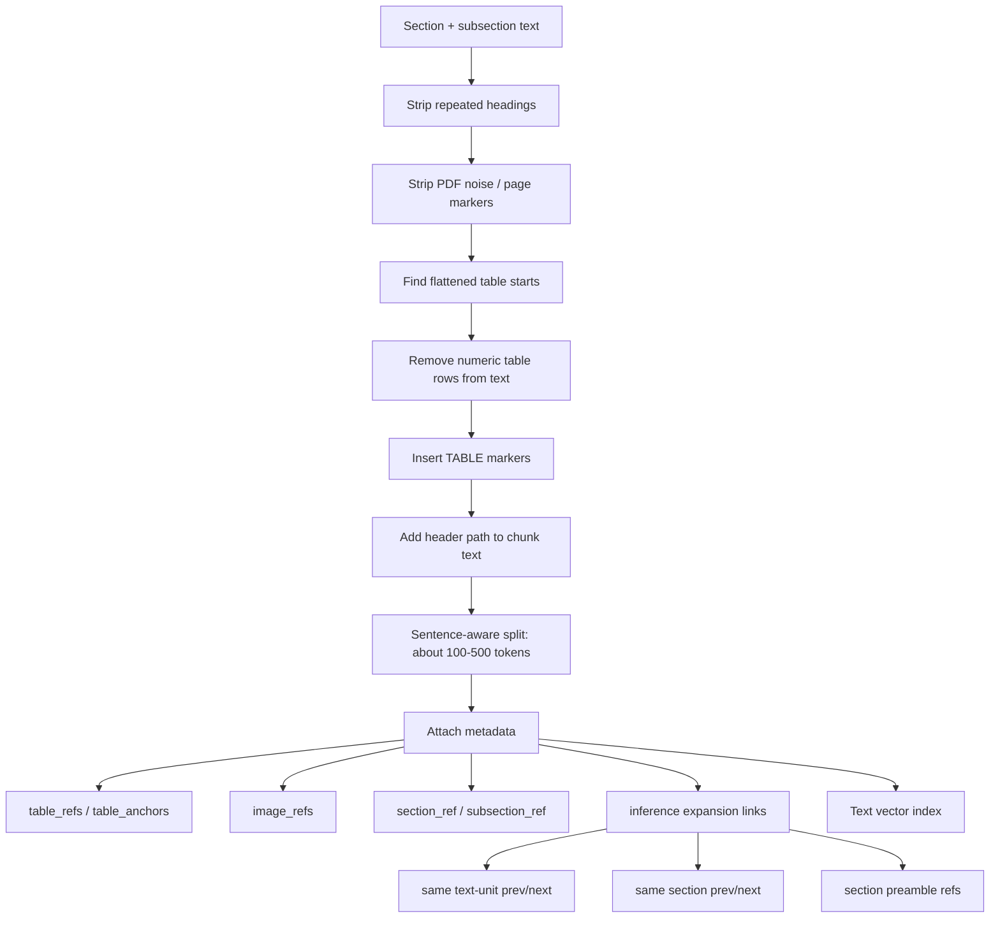

## 5. Table Extraction / Merge / VLM 导图

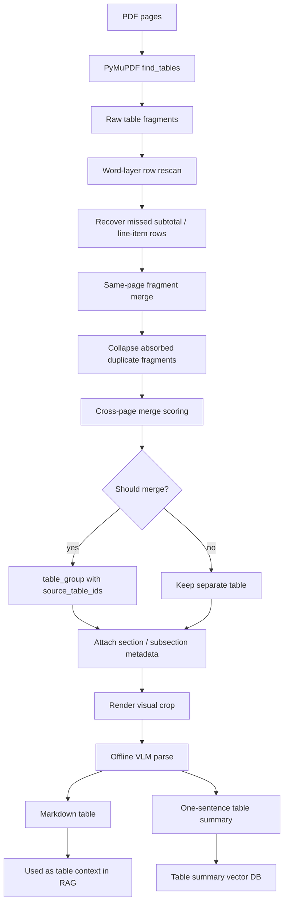

## 6. Table Corner Cases 导图

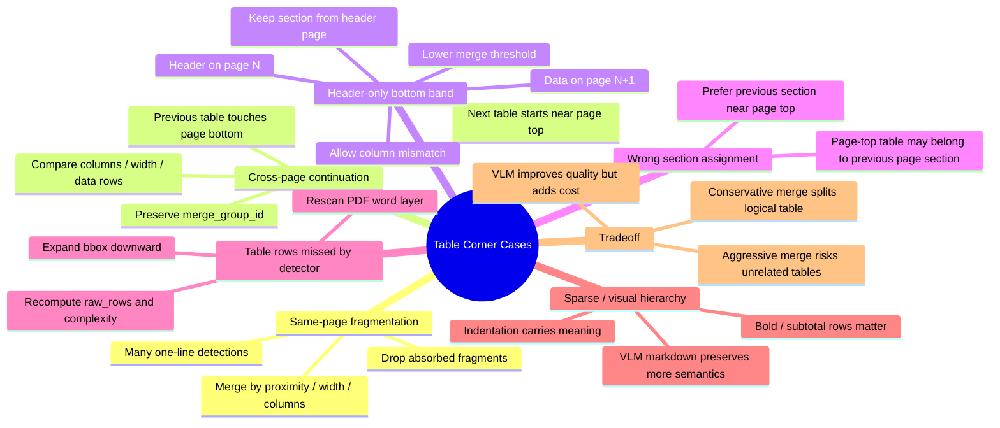

## 7. Indexing 导图

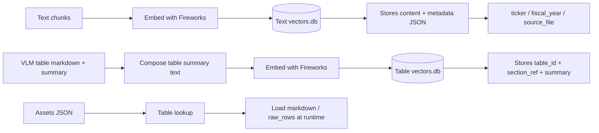

## 8. RAG Pipeline 导图

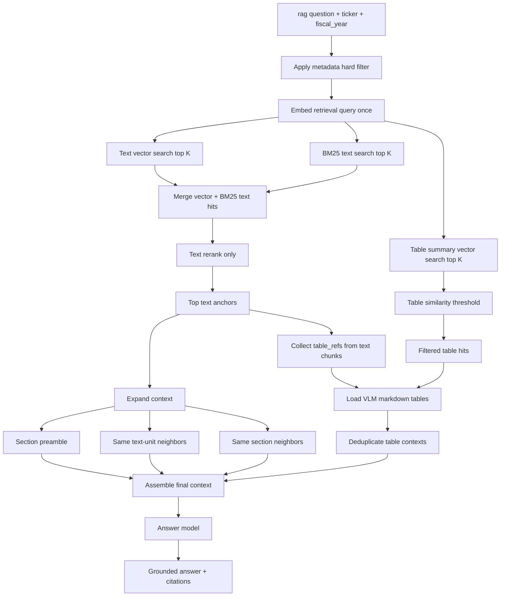

## 9. RAG Fallback / Confidence 导图

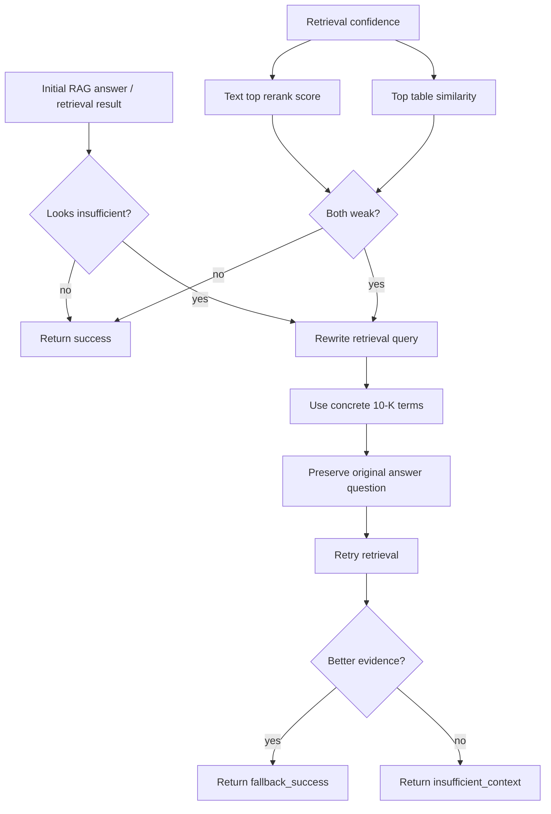

## 10. SQL Tool 导图

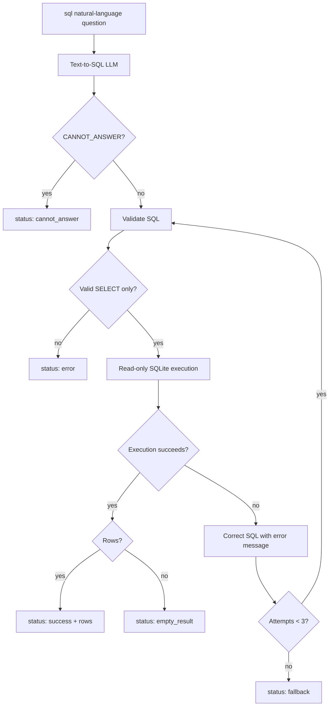

## 11. SQL / RAG Routing 导图

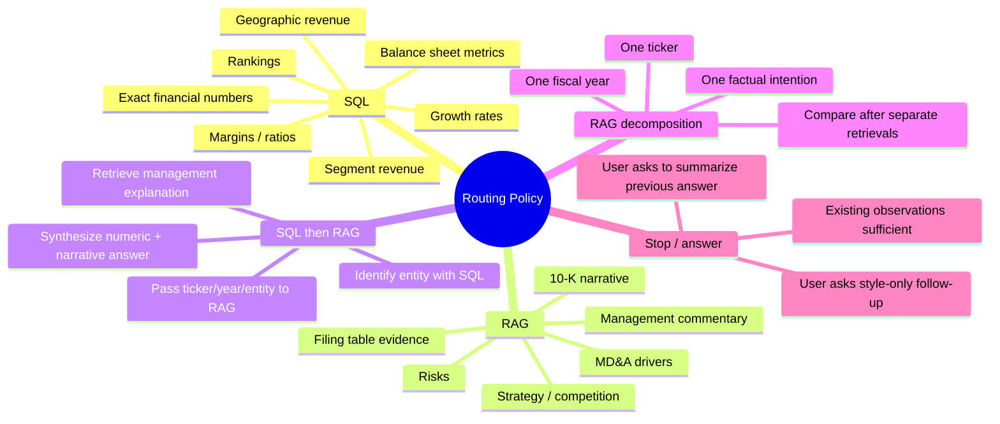

## 12. Agent Loop 导图

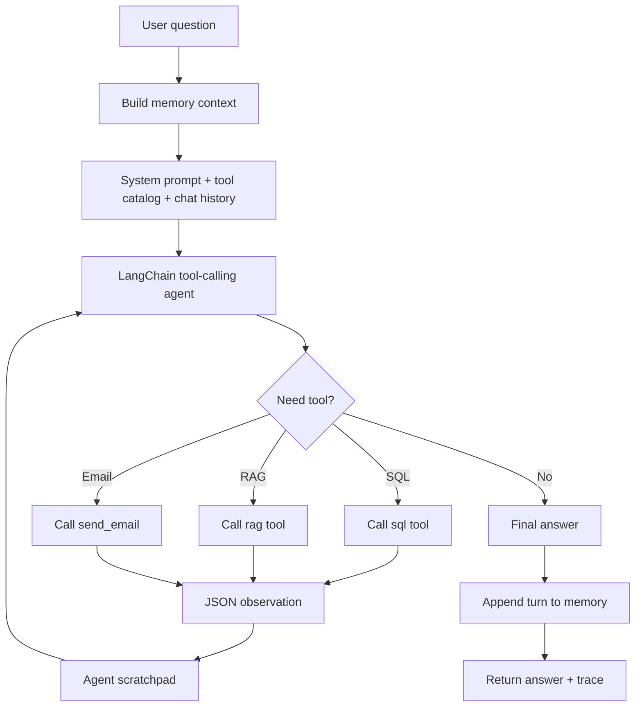

## 13. Memory 导图

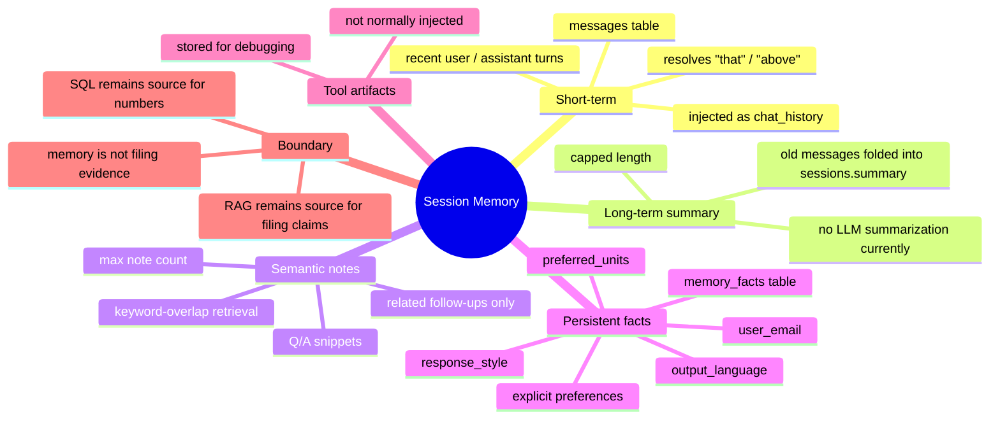

## 14. User Question 到 Answer 全链路导图

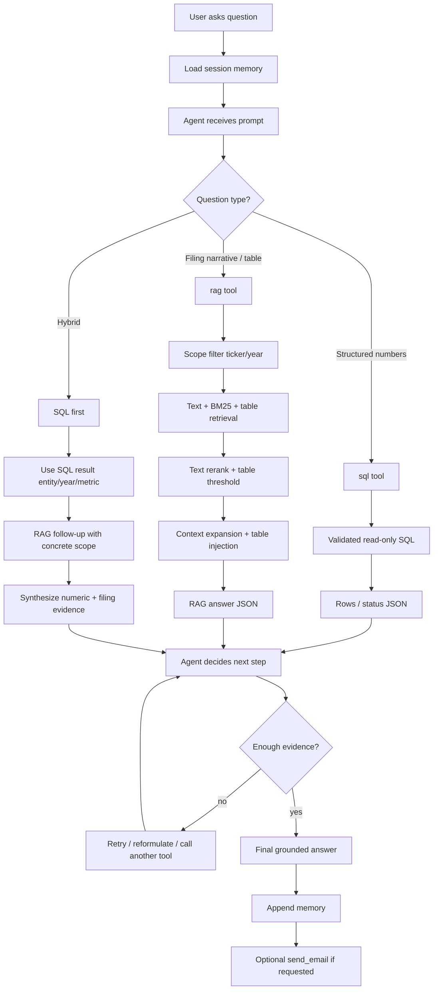

## 15. Evaluation 导图

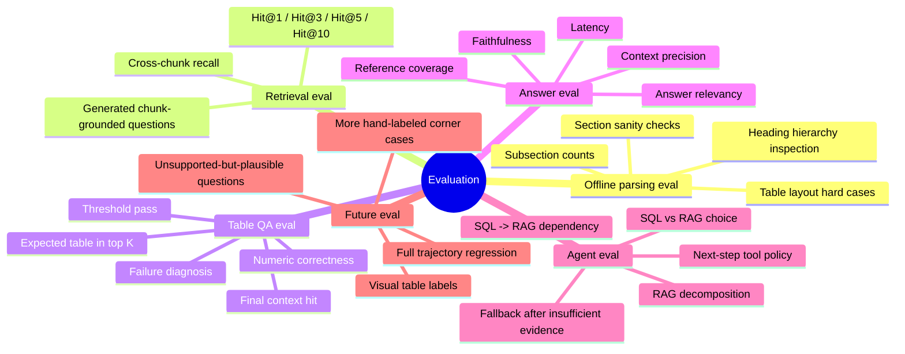
