# 10-K Agentic RAG 流程图

> 这份文件专门放可以复制到 slides 的 Mermaid flowchart。和 `ARCHITECTURE_MAPS.zh.md` 的区别是：这里尽量只用流程图，不用 mindmap。

## 1. End-to-End 全链路

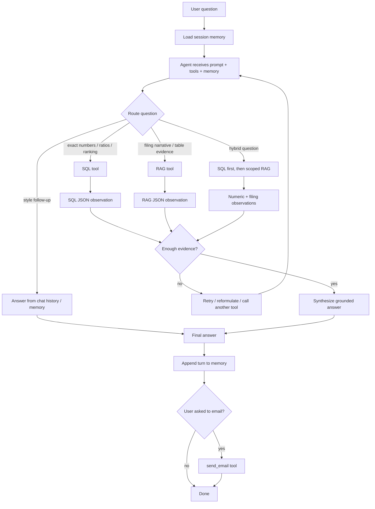

## 2. Offline PDF Processing 到 Index

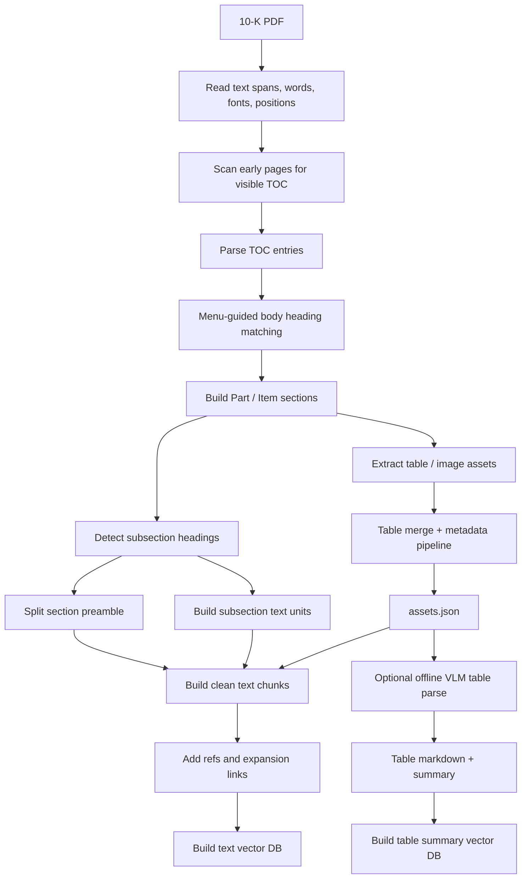

## 3. TOC-Guided Sectioning

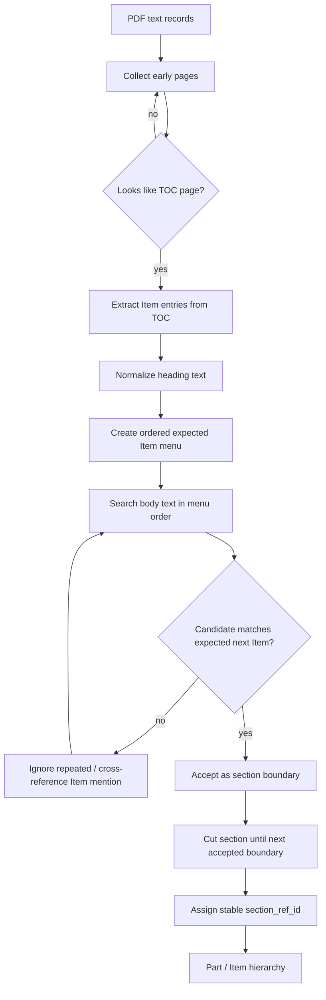

## 4. Subsection Detection

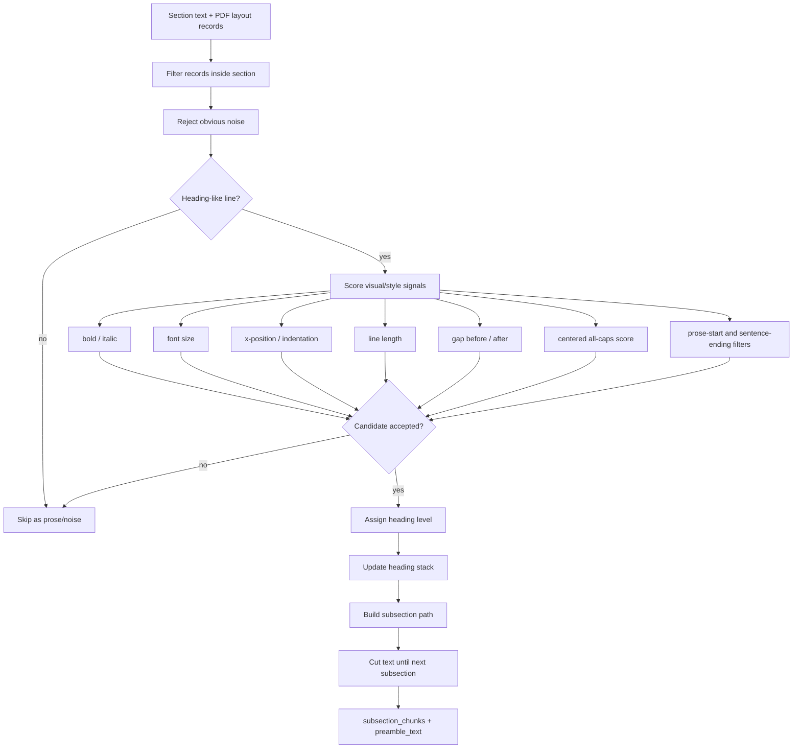

## 5. Text Chunk Builder

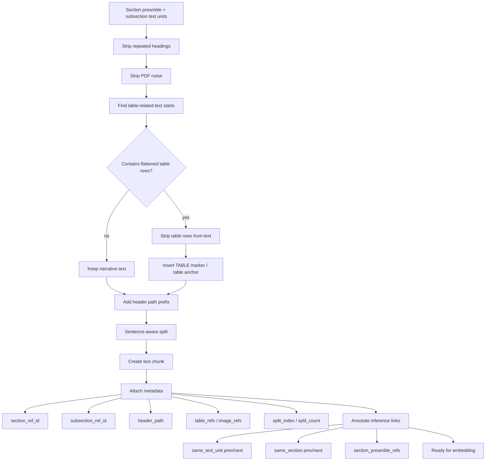

## 6. Table Extraction and Merge

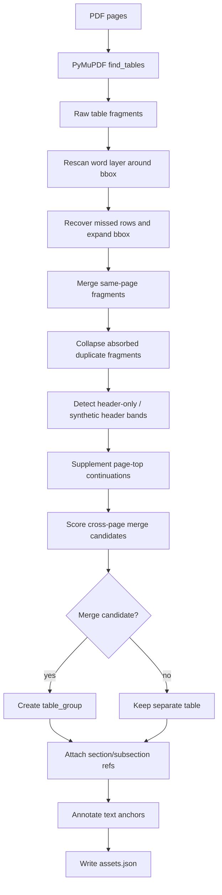

## 7. Header-Only Cross-Page Table Case

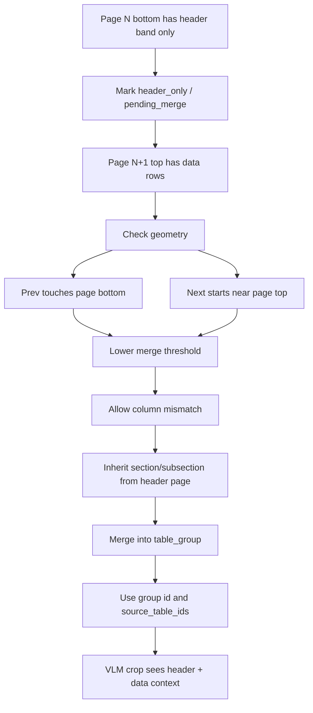

## 8. VLM Table Parse and Table Index

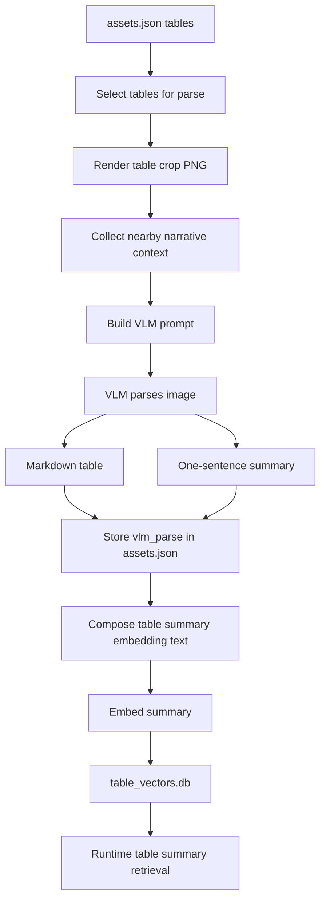

## 9. RAG Runtime

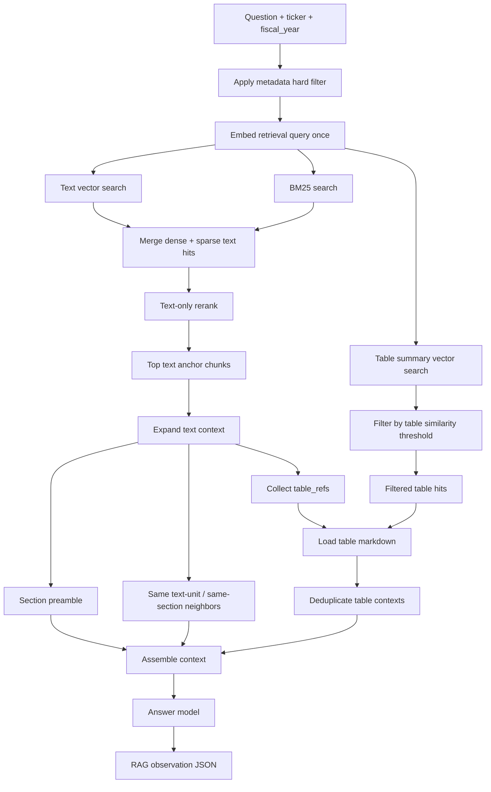

## 10. RAG Fallback

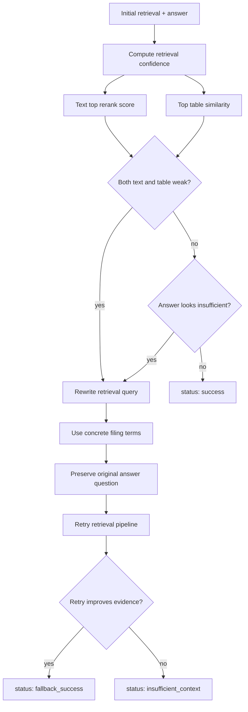

## 11. SQL Tool

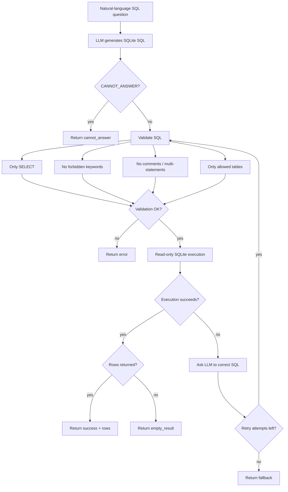

## 12. Agent Routing

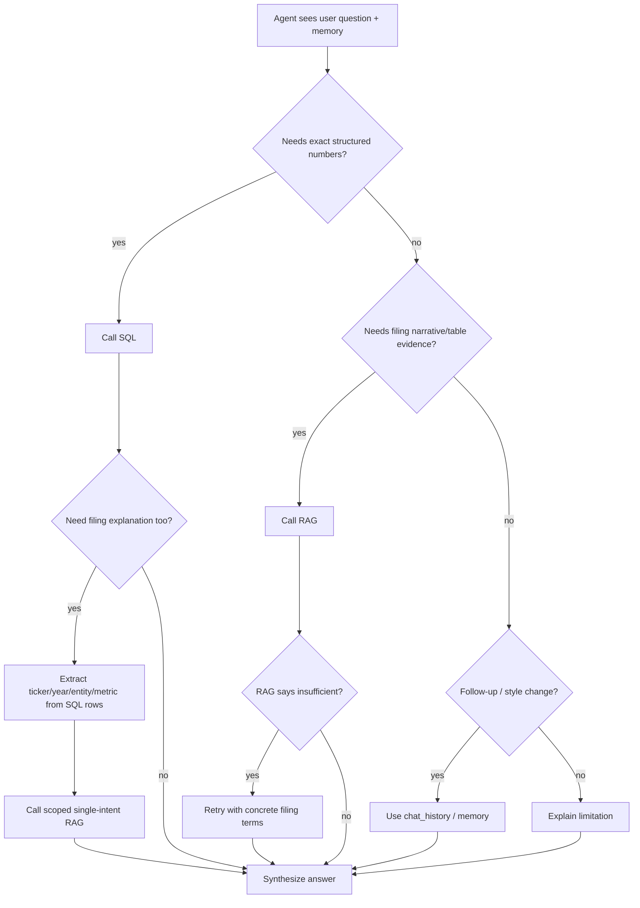

## 13. Memory Update

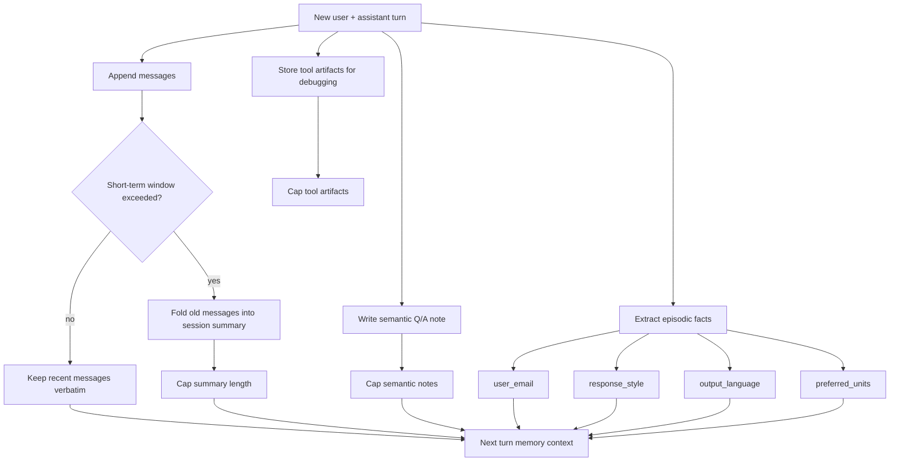

## 14. Evaluation Pipeline

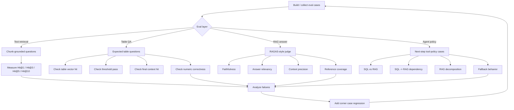

