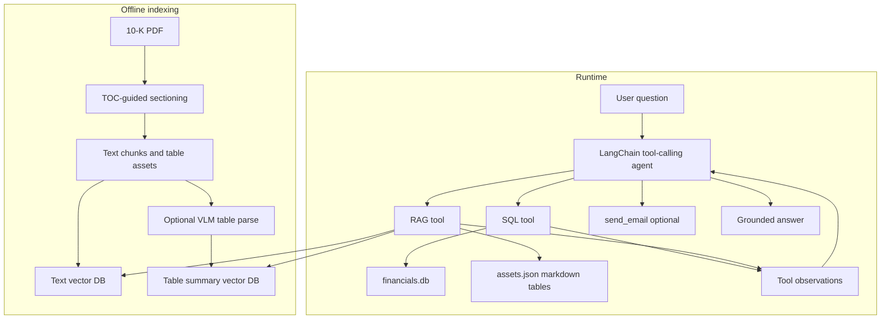
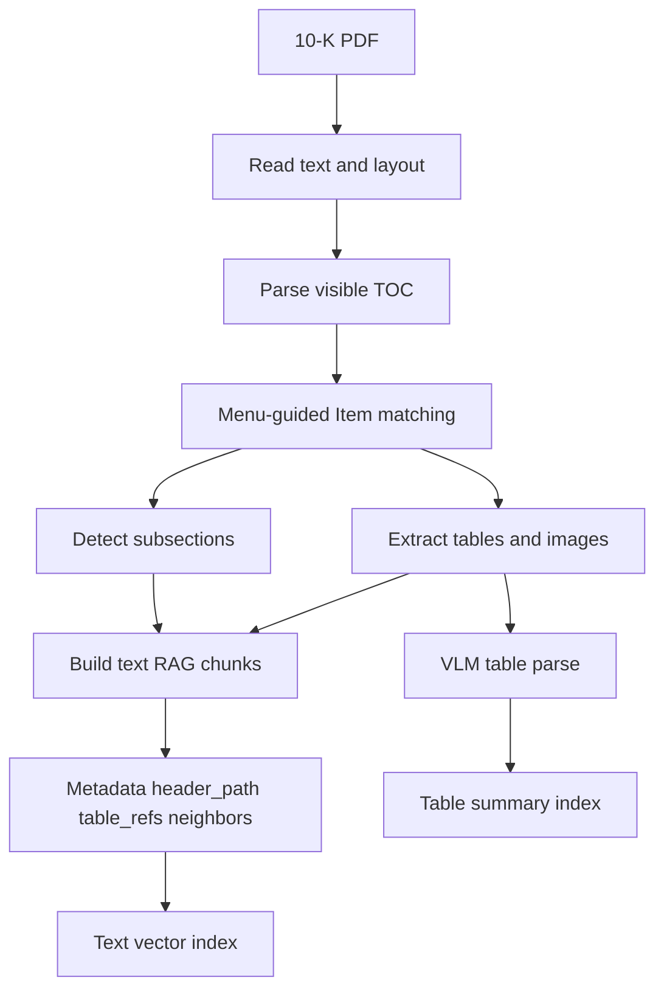
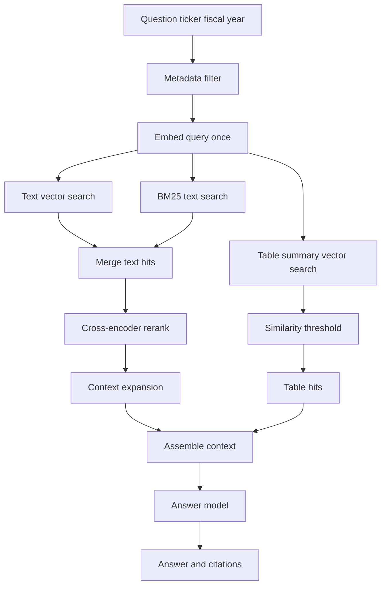

# 10-K Agentic RAG

Local stack for **Chunk Studio** (PDF chunking UI) and a **LangChain agent** (SQL + 10-K RAG + optional email) over Apple, Microsoft, and Alphabet filings.

## Architecture



### Offline chunking pipeline



### Dual-path RAG inference



## Layout

| Path | Role |
|------|------|
| `main/agent/` | LangChain agent, tools, prompts, session memory |
| `main/chunking/` | Sectioning, assets, RAG chunk build |
| `main/inference/` | Vector RAG answer pipeline |
| `main/sql/` | Text-to-SQL over `data/financials.db` |
| `chunk_studio/` | Web UI: chunk browser + `/agent` Q&A |
| `data/` | SQLite DB, PDFs, vector indexes |
| `scripts/` | Data download and DB preparation |

## Setup

```bash
python3 -m venv .venv
source .venv/bin/activate
pip install -r starter/requirements.txt
cp .env.example .env
# Set ANTHROPIC_API_KEY (required). Optional SMTP_* for send_email.
python scripts/prepare_data.py --data-dir data
```

## Run Chunk Studio + Agent

```bash
python -m uvicorn chunk_studio.server:app --host 127.0.0.1 --port 8010
```

- http://127.0.0.1:8010/ — chunk browser (process PDFs with **Build embeddings**)
- http://127.0.0.1:8010/agent — LangChain agent (SQL + workspace RAG + optional email)

## CLI (no UI)

```bash
python main/agent/agent.py "Which segment grew closest to MSFT revenue growth?"
python main/agent/agent.py "..." --json --max-steps 6
```

## Tests

```bash
python3 main/agent/test_memory_multiturn.py
python3 main/chunking/test_chunking_heuristics.py
python3 main/agent/test_filing_scope.py
```
