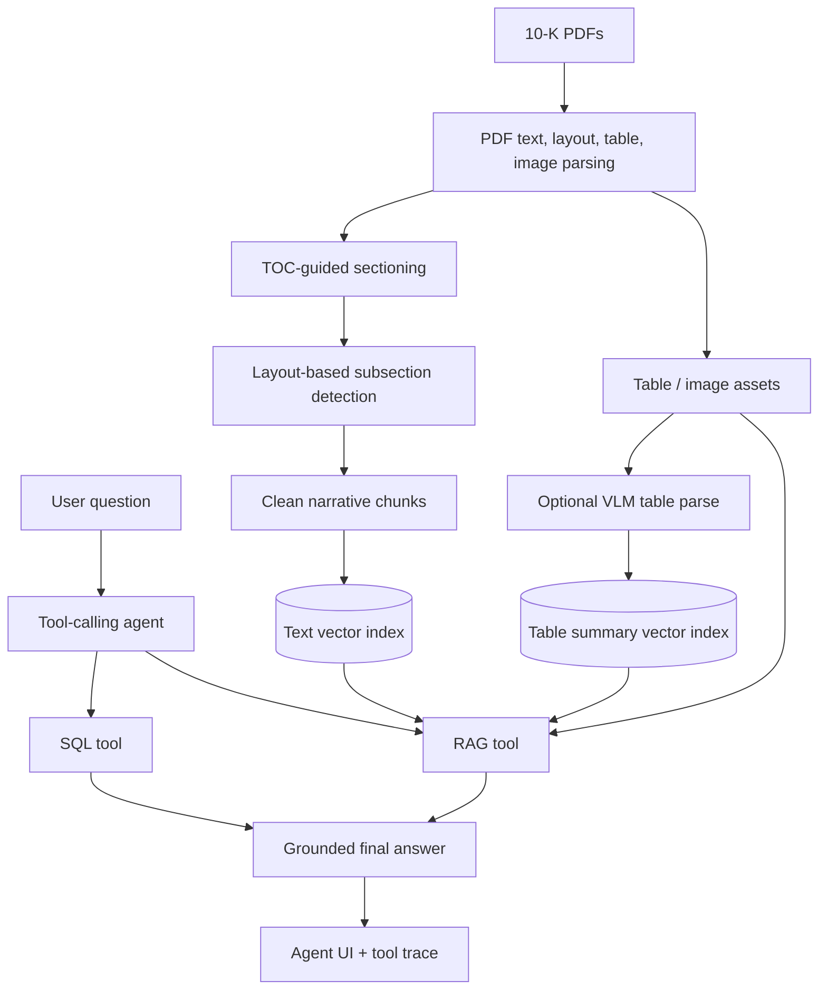
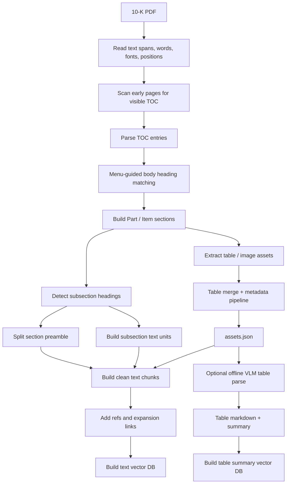
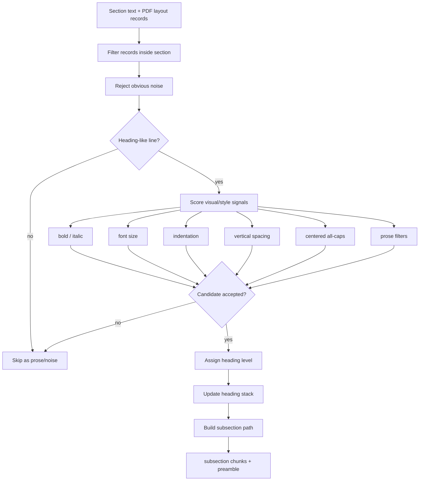
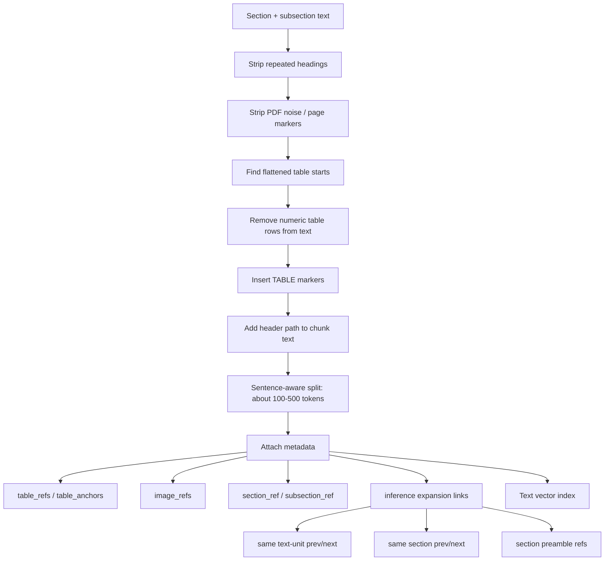
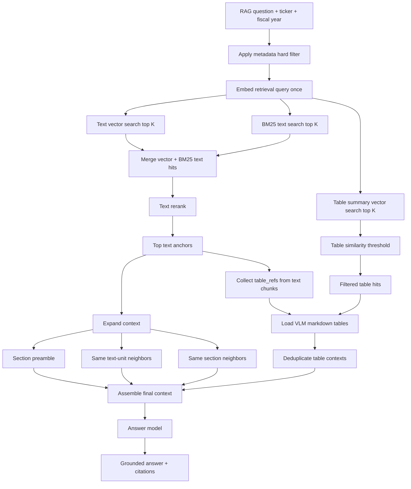

# Design Overview

This project is a local 10-K research agent. The design separates offline document processing from runtime question answering so that the agent can answer with grounded evidence instead of relying on a single generic PDF-to-text pipeline.

## System Architecture

The system has three layers:

- Offline processing turns raw 10-K PDFs into section-aware chunks, table assets, and vector indexes.
- Runtime tools expose structured financial SQL and filing-grounded RAG as separate capabilities.
- The agent routes user questions to SQL, RAG, or a SQL-then-RAG chain and streams tool traces to the UI.

## Chunking Pipeline

Generic chunking is not enough for 10-Ks because Item headings repeat in the table of contents, tables can span pages, and a single Item section can contain many unrelated topics. The chunking pipeline preserves the filing hierarchy while keeping chunks small enough for precise retrieval.

Each text chunk carries:

- ticker and fiscal year
- section and subsection references
- header path
- page range
- table and image references
- neighboring chunk links for context expansion

## Section And Subsection Detection

Main Item sections are found by parsing the visible TOC and then matching expected Item headings in body order. This avoids accepting repeated `Item 7` references from the TOC, headers, footers, or narrative cross-references.

Subsections are detected with layout signals rather than regex alone:

- bold / italic
- font size
- x-position and indentation
- vertical gap before and after
- line length
- centered all-caps score
- filters for prose-like lines and page-number noise

## Text And Table Separation

Narrative text and financial tables are treated as separate evidence types:

- Text chunks remove flattened numeric table rows so embeddings are not dominated by row noise.
- Table markers remain in text chunks so runtime RAG can reconnect nearby tables.
- Tables are stored as assets and can be parsed into markdown plus summaries.
- Table summaries are embedded separately from narrative text.

## RAG Pipeline

The RAG tool uses a dual retrieval path:

- Text retrieval combines vector search and BM25, then reranks text hits.
- Table retrieval searches embedded table summaries and applies a similarity threshold.
- Context assembly expands selected text chunks with preamble and neighbors.
- Table contexts are loaded from directly referenced tables and independently retrieved table hits.

## Agent Routing

The agent is intentionally tool-driven:

- SQL is used for exact metrics, ratios, rankings, and year-over-year comparisons from structured financial data.
- RAG is used for what the filing says: strategy, risk, MD&A explanation, segment commentary, and table evidence.
- Hybrid questions use SQL first to establish numbers, then RAG to retrieve the filing explanation scoped to the relevant company and fiscal year.

```mermaid
flowchart TD
  U[User question] --> A[Agent receives prompt + tools]
  A --> R{Route question}
  R -- exact numbers / ratios / ranking --> SQL[SQL tool]
  R -- filing narrative / table evidence --> RAG[RAG tool]
  R -- hybrid question --> H[SQL first, then scoped RAG]
  SQL --> SQLOBS[SQL JSON observation]
  RAG --> RAGOBS[RAG JSON observation]
  H --> HOBS[Numeric + filing observations]
  SQLOBS --> D{Enough evidence?}
  RAGOBS --> D
  HOBS --> D
  D -- no --> RETRY[Retry / reformulate / call another tool]
  RETRY --> A
  D -- yes --> SYN[Synthesize grounded answer]
  SYN --> OUT[Final answer]
```

## Design Tradeoffs

- Heuristic layout detection is explainable and fast, but it is not a perfect visual reconstruction of the PDF.
- Small chunks improve retrieval precision, but they require metadata-driven context expansion at inference time.
- Separating text and table evidence improves retrieval quality, but requires explicit table references and table context loading.
- Tool routing reduces hallucination risk, but the agent needs clear tool policy and visible traces for debugging.
