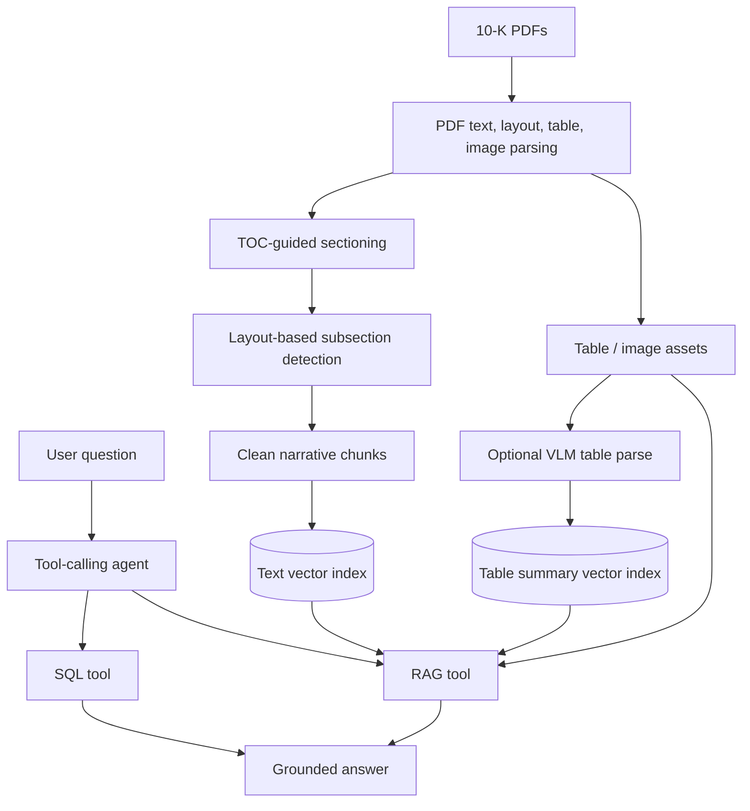
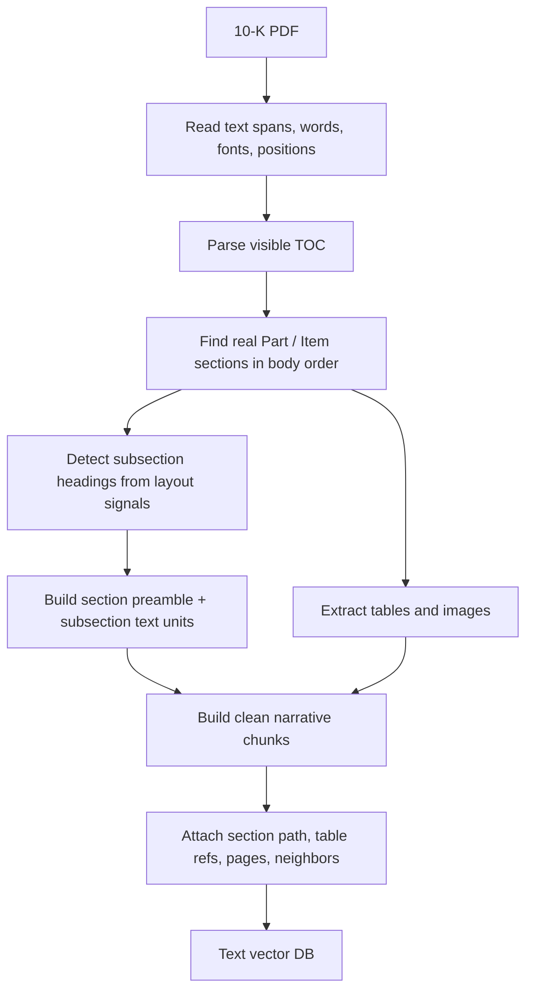
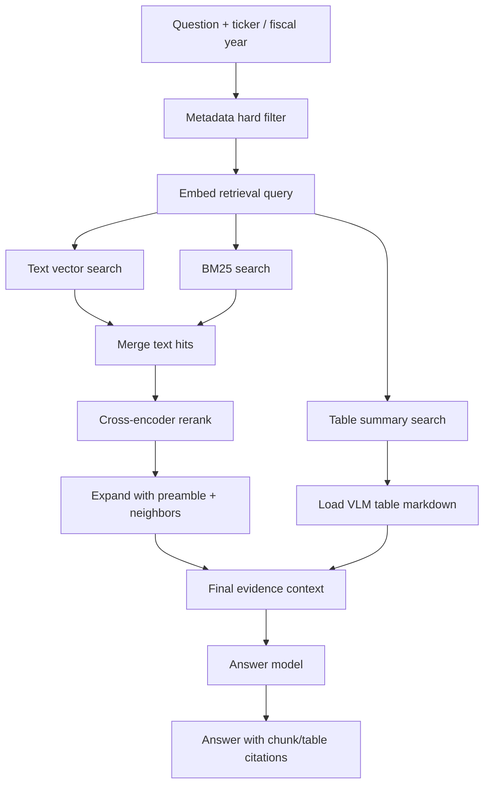

# 10-K Agentic RAG

Code for a local 10-K agentic RAG prototype with chunk inspection UI and agent Q&A.

This repo includes a local chunk inspection UI, a tool-calling agent, and separate retrieval paths for narrative 10-K text and table evidence.

## Design

More detail is in [DESIGN.md](DESIGN.md), but the core design is:



### Chunking

The offline pipeline keeps 10-K structure instead of using generic fixed-size PDF chunks.



### RAG

RAG uses text and table evidence separately, then assembles them into one grounded context.



### Agent Routing

- SQL handles exact metrics, ratios, rankings, and structured financial comparisons.
- RAG handles filing narrative, MD&A, risks, strategy, and table-backed evidence.
- Hybrid questions run SQL first, then use scoped RAG for the filing explanation.

## Run

```bash
python -m venv .venv
. .venv/bin/activate
pip install -r starter/requirements.txt
python -m chunk_studio.server
```

Open `http://127.0.0.1:8010/` for Chunks and `http://127.0.0.1:8010/agent` for Agent Q&A.

Set API keys in a local `.env` file. Do not commit `.env`.
